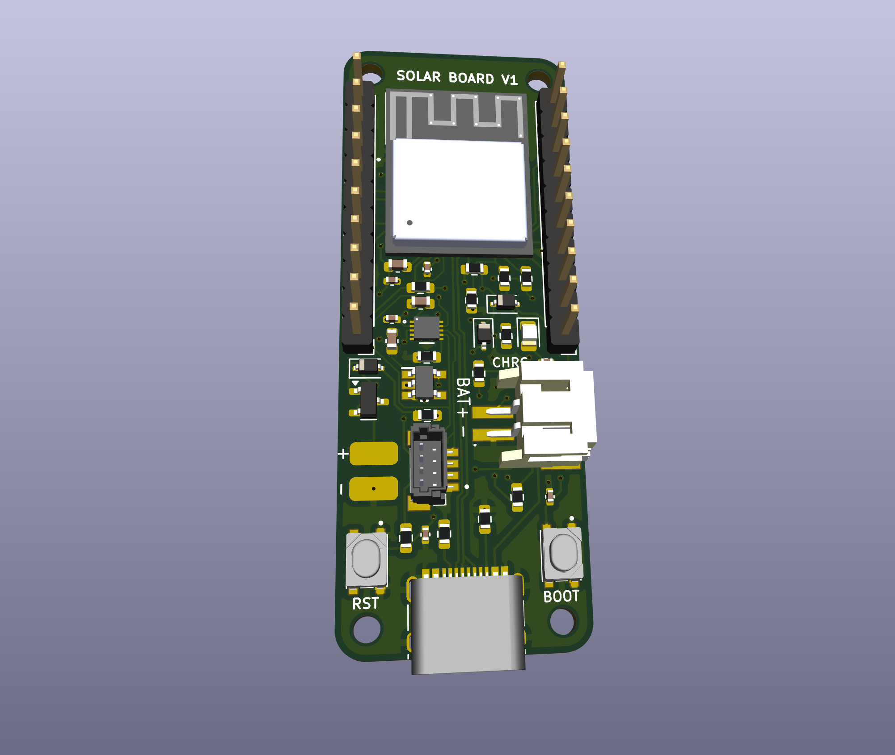
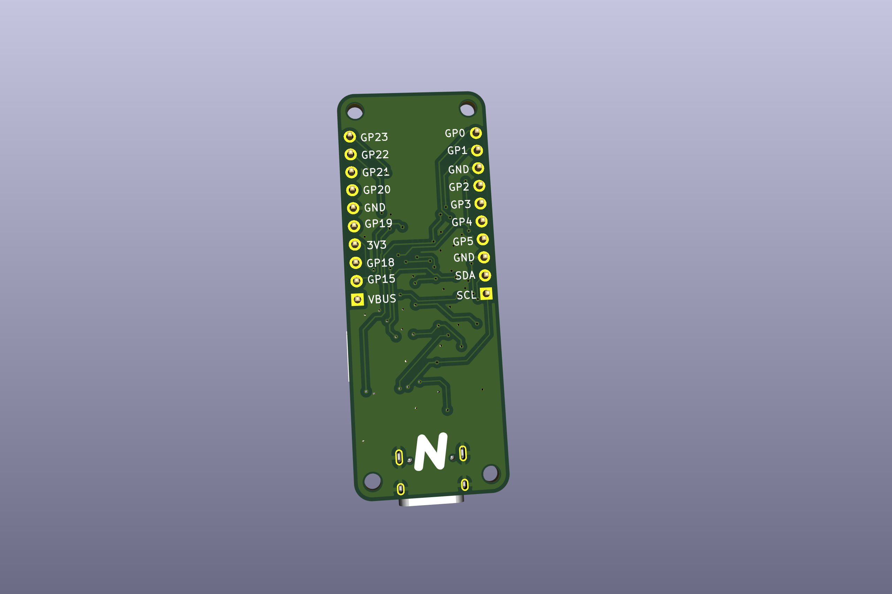
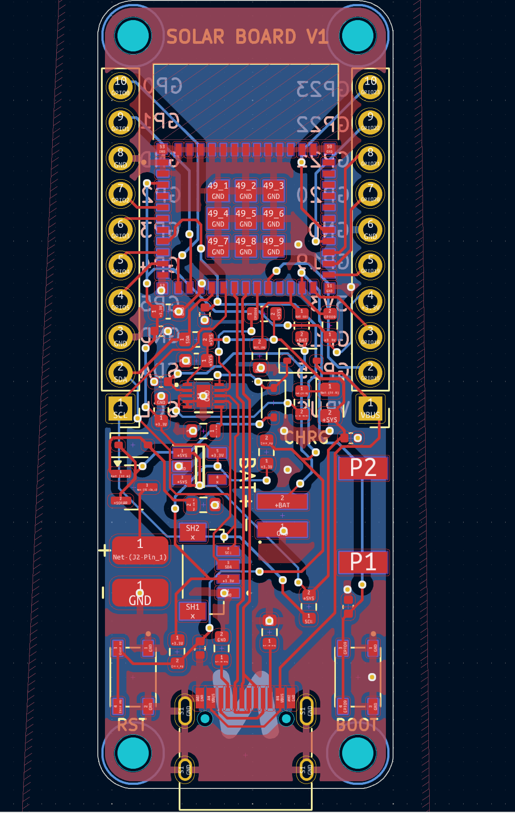
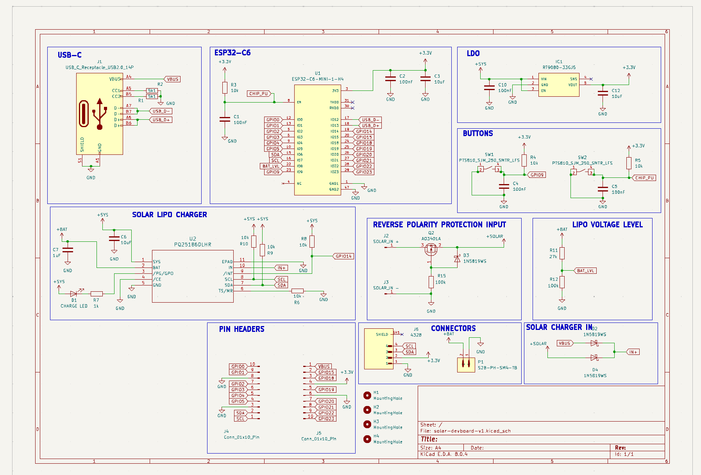

## Solar Devboard
An ESP32 C6 mini based devboard that combines zigbee/wifi with solar and lipo charging to easily deploy remote sensing IOT devices.

## Features
- 3.7v Lipo charging circuit and JST connector
- Support for 3v - 18v solar panels
- ADC for lipo charge monitoring
- Power path for charging while on usb-c power
- Extremely compact form factor
- M2 mounting holes

## Why
- Solar panels are extremely useful for remote sensing applications to provide a power source without long wires or very large batteries
- Most solar projects require boost converters and extra breakout boards to connect lipo batteries safely
- Most solar charging boards are too large to be used in compact applications

## BOM
[View the BOM here](./BOM.csv)

